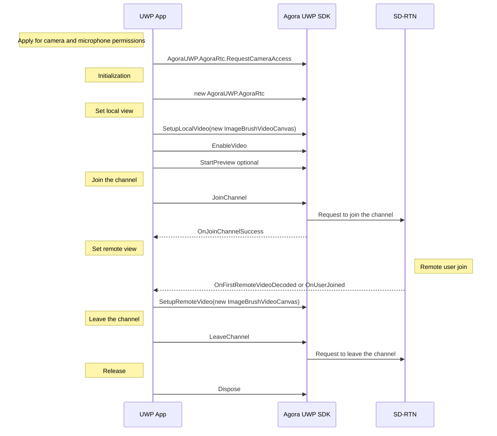
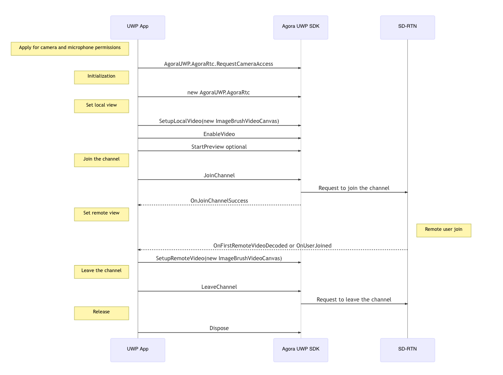
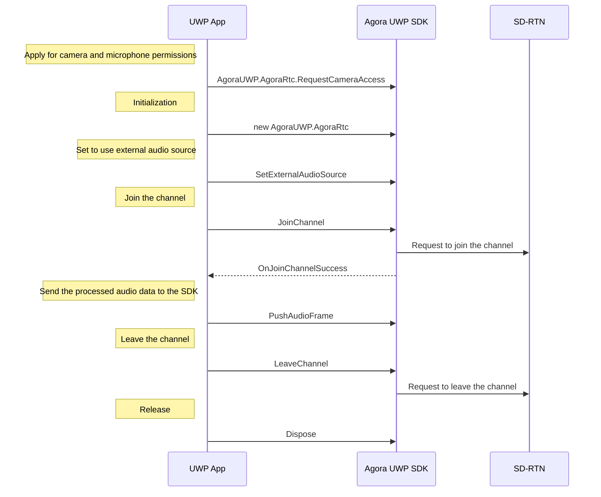
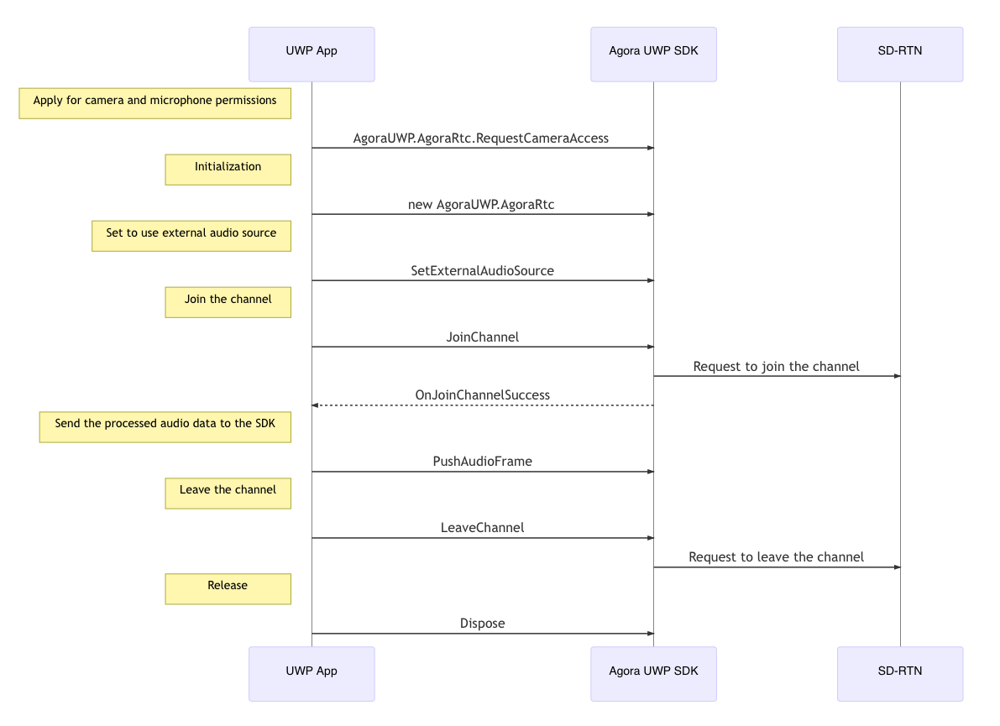
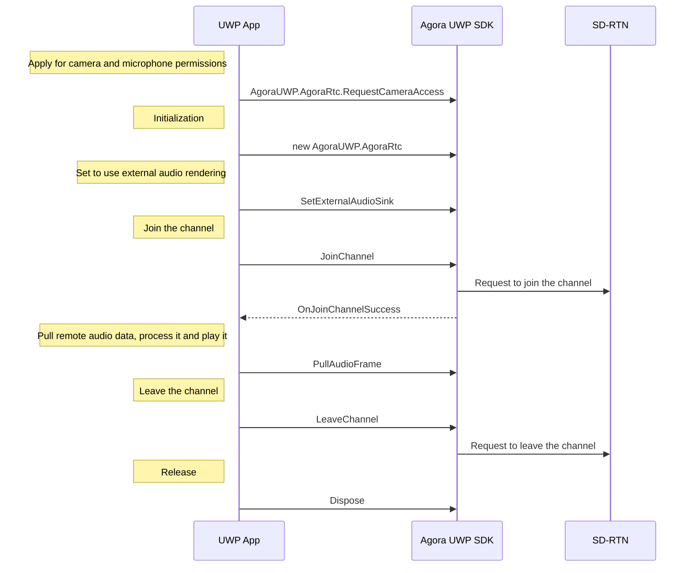
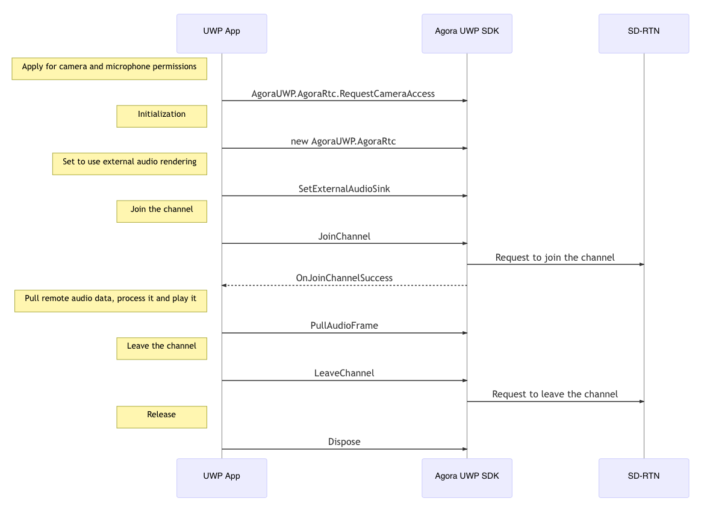

# AgoraWinRT Development Manual

In UWP, Agora C++ Native Development kit cannot get the camera and microphone permission because they should be explicitly applying,  and because window has not the handle property in UWP, Agora C++ Native also cannot render video data by default function like setupLocalVideo and setupRemoteVideo. On the other hand, UWP development is more friendly to C# users. 

Based on those reasons, this project encapsulates native c++ kit to WinRT kit, and based of WinRT kit, it encapsulates UWP kit to manage video and audio devices. If you are c++ user, you can also directly use WinRT kit for development.

## Architecture Description

The whole architecture is divided into two main parts: AgoraWinRT and AgoraUWP.

AgoraWinRT encapsulated for Agora C++ Native.

AgoraUWP is based on AgoraWinRT , and add device managemet and video render on UWP.

### AgoraWinRT Description

When AgoraWinRT encapsulated  the Agora C++ API, it use same function names and type names with Agora C++ expect for the namespace. Users can directly refer to [Agora C++ API Reference for All Platforms](https://docs.agora.io/en/Audio%20Broadcast/API%20Reference/cpp/index.html) to find the corresponding type and function description.

#### AgoraWinRT Doesn't Encapsulated Parts

In AgoraWinRT, some Agora C++ API are not encapsulated, the following list is those function's name and reason.

| Name                                | Reason                                                       |
| ----------------------------------- | ------------------------------------------------------------ |
| Screen Capture                      | not implemented temporarily                                  |
| Face Detection                      | Android and iOS                                              |
| Audio Routing Control               | Android and iOS                                              |
| In-ear Monitoring                   | Android and iOS                                              |
| Camera Control                      | Android and iOS                                              |
| setAudioSessionOperationRestriction | iOS                                                          |
| queryInterface                      | useless in WinRT                                             |
| IVideoDeviceManager                 | implemented in specific platform such as UWP platform. For more details, please refer to [AgoraUWP Description](#AgoraUWP description) |
| initialize                          | integrate into constructor                                   |
| release                             | integrate into dispose                                       |
| setupLocalVideo                     | implemented in specific platform such as UWP platform. For more details, please refer to [AgoraUWP Description](#AgoraUWP description) |
| setupRemoteVideo                    | implemented in specific platform such as UWP platform. For more details, please refer to [AgoraUWP Description](#AgoraUWP description) |
| setLocalRenderMode                  | implemented in specific platform such as UWP platform. For more details, please refer to [AgoraUWP Description](#AgoraUWP description) |
| setRemoteRenderMode                 | implemented in specific platform such as UWP platform. For more details, please refer to [AgoraUWP Description](#AgoraUWP description) |
| startPreview                        | implemented in specific platform such as UWP platform. For more details, please refer to [AgoraUWP Description](#AgoraUWP description) |
| stopPreview                         | implemented in specific platform such as UWP platform. For more details, please refer to [AgoraUWP Description](#AgoraUWP description) |
| enableLocalVideo                    | implemented in specific platform such as UWP platform. For more details, please refer to [AgoraUWP Description](#AgoraUWP description) |
| onVideoDeviceStateChanged           | implemented in specific platform such as UWP platform. For more details, please refer to [AgoraUWP Description](#AgoraUWP description) |

#### AgoraWinRT Project Files Description

AgoraWinRT project is a Windows Runtime Component (C++ WinRT) project, and it's interfaces are defined in serval idl files.

| File Name                        | Description                                                  |
| -------------------------------- | ------------------------------------------------------------ |
| AgoraWinRT.idl                   | the main interface file, which is a WinRT redefinition version of  the interface of AgoraRtc in Agora C++ |
| AgoraWinRTInterfaces.idl         | the event interfaces definition file, it includes  AgoraRtcEventHandler、MetadataObserver、AudioFrameObserver、VideoFrameObserver, PacketObserver. User can implement interface and call registration method to subscript events. |
| AgoraWinRTAudioDeviceManager.idl | include redefinition version of Agora C++ IAudioDeviceManager |
| AgoraWinRTChannel.idl            | include redefinition version of Agora C++ IChannel and IChannelEventHandler |
| AgoraWinRTTypes.idl              | include types redefiniton version of Agora C++ SDK           |
| AgoraWinRTEnums.idl              | include enums redefinition version of  Agora C++ SDK         |

#### AgoraWinRT::AgoraRtc Event Registration Method Description

AgoraWinRT::AgoraRtc is the core class of AgoraWinRT, which encapsulate AgoraRtc in Agora C++, and provides event registration methods that user can  those methods to subscript events.

| Event Registration Method     | Event Interface                                              |
| ----------------------------- | ------------------------------------------------------------ |
| RegisterRtcEngineEventHandler | AgoraRtcEventHandler                                         |
| RegisterMediaMetadataObserver | MetadataObserver                                             |
| RegisterPacketObserver        | PacketObserver，based on the internal implementation of Agora, only registration will not make this interface work. User must be call enableEncryption to make enable is true,  then PacketObserver's event can take effect. |
| RegisterAudioFrameObserver    | AudioFrameObserver                                           |
| RegisterVideoFrameObserver    | VideoFrameObserver                                           |

#### Special Feature of AgoraWinRT::AgoraRtc

AgoraWinRT::AgoraRtc removes initialize and release functions. Instead of that, it automatically initialize the RTC engine when AgoraWinRT::AgoraRtc class is created in constructor and automatically call the engine's release function when AgoraWinRT::AgoraRtc instance be destructed.

At the same time, AgoraWinRT::AgoraRtc implements the IDispose interface, so users can use Using or directly call the dispose method to release resources. 

**NOTE: user can not use AgoraWinRT::AgoraRtc instance again after calling Dispose method, instead of that , user must recreate a new instance of AgoraWinRT::AgoraRtc.**

#### AgoraWinRT::AgoraRtc's Functions and Event Interfaces Document

[As mentioned above](#AgoarWinRT description), the name of all funcitons, types, enums and interfaces definitions  in AgoraWinRT::AgoraRtc are consistent with those in Agora C++ Naive SDK. Developers can use [the official documents](https://docs.agora.io/en/Audio%20Broadcast/API%20Reference/cpp/index.html) to find specific information of functions, types, enums and interfaces.

### AgoraUWP Description

AgoraUWP is based on AgoraWinRT , implemented by C#. It provides VideoDeviceManager, permission request, video capture and rendering in UWP platform. At the same time,  the three interfaces, AgoraRtcEventHandler, VideoFrameObserver, AudioFrameObserver, are implemented by default, and the functions among them are converted to C# style events from callback function.

AgoraUWP use same function names and type names with Agora C++ like AgoraWinRT, expect for the namespace. 

#### AgoraUWP Project Files Description

AgoraUWP is a DLL(Universal Windows) project

| 文件名                     | 用途说明                                                     |
| -------------------------- | ------------------------------------------------------------ |
| AgoraUWP.cs                | The main file of AgoraUWP, which includes AgoraUWP.AgoraRtc class. This class implements three AgoraWinRT interfaces: AgoraWinRT::AgoraRtcEventHandler、AgoraWinRT::VideoFrameObserver、AgoraWinRT::AudioFrameObserver in privately, and exposes those intefaces by events. It also provide video capture and rendering capabilities on UWP platform, so the development can simply use this SDK to implements video and audio communication app like using Agora C++ SDK. |
| AgoraUWPDelegate.cs        | include redefinition version of AgoraWinRT::AgoraRtcEventHandler、AgoraWinRT::VideoFrameObserver、AgoraWinRT::AudioFrameObserver |
| IVideoDeviceCollection.cs  | include redefinition version of AgoraWinRT::IVideoDeviceCollection |
| VideoDeviceManager.cs      | include redefinition version of AgoraWinRT::IVideoDevicemanger，and include a implementation of AgoraWinRT::IVideoDeviceCollection and AgoraWinRT::IVideoDeviceManager on UWP platform |
| VideoCanvas.cs             | because there is no window handle on UWP platform, therefore, the VideoCanvas abstract class is defined to unify the implementation interface of video rendering on UWP platform, for specific instruction, refer to [VideoCanas](#VideoCanvas) |
| ImageBrushVideoCanvas.cs   | a VideoCanvas implementation based on ImageBrush.            |
| IMediaCapturer.cs          | the media capture interface used by AgoraUWP.AgoraRtc        |
| GeneralMediaCapturer.cs    | a default implementation of AgoraWinRT::IMediaCapturer interface, it also is the default media capture used by AgoraUWP.AgoraRtc |
| MediaCaptureVideoSource.cs | a implementation of Agora C++ VideoSource based on GeneralMediaCapturer |

#### AgoraUWP.AgoraRtc

This class is the core class in AgoraUWP. It inherits from AgoraWinRT::AgoraRtc and implements AgoraWinRT::AgoraRtcEventHandler, AgoraWinRT::VideoFrameObserver, AgoraWinRT::AudioFrameObserver interfaces, and converts them into events.

This class provides video capture, video rendering and device management functions on UWP platform that were not implmented on AgoraWinRT, and implemented setupLocalVideo, setupRemoteVideo, setLocalRenderMode, setRemoteRenderMode, startPreview, stopPreview, enableLocalVideo functions.

These are serval differences between AgoraUWP.AgoraRtc and Agora C++ SDK:

1. User need to apply for permission to use camera and microphone on UWP platform. After testing, in progress of applying permission, a pop-up confirmation windows cannot show in synchronous function     . Therefore, AgoraUWP add RequestCameraAccess asynchronous static function, user must call this function to apply permission before create and using AgoraUWP.AgoraRtc instance.
2. the SetupLocalVideo and SetupRemoteVideo functions's parameters are changed to accept AgoraUWP.VideCanvas, because it has not window handle on UWP platform.  User can use AgoraUWP.ImageBrushVideoCanvas to implement video rendering on ImageBrush, and user can inherits VideoCanvas to implement video rendering for they own.

#### AgoraUWP.IMediaCapturer and AgoraUWP.GeneralMediaCapturer

IMediaCapturer defines an audio and video frame capturer on UWP, and GeneralMediaCapturer is its default implementation.

GeneralMediaCapturer itself is not only used by AgoraUWP.AgoraRtc as an internal video frame capture, but also can be used independently as an audio and video frame capture for audio and video self-capturing.

The definition of IMediaCapturer is as follows:

1. VideoDevice

   Get the video device used by the current capture, which may be null

2. AudioDevice

   Get the audio device used by the current capture, which may be null

3. AudioFormat

   The currently used audio format data, such as sampling rate, number of channels, etc., can be found in msdn about [MediaFrameFormat](https://docs.microsoft.com/en-us/uwp/api/Windows.Media.Capture. Frames.MediaFrameFormat?redirectedfrom=MSDN&view=winrt-19041) part

4. VideoFormat

   Video format data currently in use

5. VideoBufferType

   The format of the currently given video data buffer, the default is VIDEO_BUFFER_RAW_DATA

6. OnVideoFrameArrived

   Trigger when video frame data is collected

7. EnableVideo

   Whether to enable video frame capture, the default is true, if set to false, OnVideoFrameArrived will not  be triggered

8. OnAudioFrameArrived

   Trigger when the audio frame data is collected

9. EnableAudio

   Whether to enable the capture of audio frames, the default is true, if set to false, OnAudioFrameArrived will not be triggered

#### VideoCanvas and ImageBrushVideoCanvas

VideoCanvas defines the methods and properties that can be accepted by SetupLocalVideo and SetupRemoteVideo functions in AgoraUWP.AgoraRtc.

ImageBrushVideoCanvas is a VideoCanvas implementation class based on ImageBrush.

The definition of VideoCanvas is as follows:

1. Target

   Objects that need to be rendered on, such as ImageBrush objects in ImageBrushVideoCanvas

2. RenderMode

   How to fill the video in the video rendering window

3. Channel

   The channel of the source of the video

4. User

   User id corresponding to the video

5. MirrorMode

   Does the video need to be mirrored

6. Render(MediaFrameReference)

   The rendering method used in the local video preview

7. Render(VideoFrame)

   Methods to call when AgoraUWP.AgoraRtc performs local and remote video rendering

The VideoCanvas class is an abstract class, in which two Render functions are implemented as virtual methods, which is convenient for users to selectively implement the two methods according to their needs. For example, VideoCanvas in the StartDeviceTest of VideoDeviceManager can only implement Render(MediaFrameReference), because of this function VideoCanvas is only used in local video testing.

#### MediaCaptureVideoSource

Agora C++ provides a setVideoSource method, which allows users to provide their own VideoSource, but in Agora's example, the custom video capture is performed in two methods: setExternalVideoSource and pushVideoFrame. 

So this class only provides an example of a custom VideoSource based on GeneralMeidaCapturer. Users can refer to it to implement their own VideoSource.

## Demo description

AgoraUWPDemo is an example of using AgoraUWP.

Three modes are demonstrated in the example:

1. Use SDK internal-collection mode

    Use the internal audio and video collection inside the AgoraUWP SDK, users don't need to care about the collection part.

2. Use audio self-collection

    It demonstrates how to use GeneralMediaCapturer for audio self-collection. As an example, users can refer to and implement their own audio self-collection method.

3. Use audio self-rendering

    Demonstrates how to use [AudioGraph](https://docs.microsoft.com/en-us/uwp/api/windows.media.audio.audiograph?view=winrt-19041) combined with [PullAudioFrame](https://docs .agora.io/en/Video/API%20Reference/cpp/classagora_1_1media_1_1_i_media_engine.html#aaf43fc265eb4707bb59f1bf0cbe01940) to render external audio.

At the same time, the example also demonstrates how to adjust the video resolution, frame rate, bit rate, etc.

### Use SDK Internal-collection Mode

This process corresponds to the section [How to quickly start](https://docs.agora.io/en/Video/start_call_windows?platform=Windows)





Please note that due to UWP platform restrictions, you must apply for camera and microphone permissions before you can use it. Therefore, at the very beginning of program, user must to call the AgoraUWP.AgoraRtc.RequestCameraAccess asynchronous method to apply for permission, otherwise it will cause AgoraUWP.AgoraRtc to fail to obtain device permissions.

### Use Audio Self-collection

This process corresponds to the first half of the section [Custom Audio Capture and Rendering](https://docs.agora.io/en/Video/custom_audio_windows?platform=Windows), the Custom Audio Capture.





Start function is 

```c#
private void StartEngineAndSelfAudioProcess()
{
    InitEngine();
    InitAudioCapture();
    this.engine.SetExternalAudioSource(true, m_audioCapture.AudioFormat.AudioEncodingProperties.SampleRate, (byte)m_audioCapture.AudioFormat.AudioEncodingProperties.ChannelCount);
}
```

In this function, in addition to initializing the engine, an audio capture based on GeneralMediaCapturer is also be created.

```c#
private void InitAudioCapture()
{
    var sourceGroup = MediaFrameSourceGroup.FindAllAsync().AsTask().GetAwaiter().GetResult();
    if (sourceGroup.Count == 0) return;
    m_audioCapture = new GeneralMediaCapturer(sourceGroup[0], StreamingCaptureMode.Audio);
    m_audioCapture.OnAudioFrameArrived += AudioFrameArrivedEvent;
}
```

In this audio collector, when audio data is collected, AudioFrameArrivedEvent is triggered. After the collected PCM32 audio data is converted into PCM16 audio data that Agora C++ SDK can process, it is sent to  PushAudioFrame function.

```c#
private void AudioFrameArrivedEvent(AudioMediaFrame frame)
{
    using (Windows.Media.AudioFrame rawAudioFrame = frame.GetAudioFrame())
        using (AudioBuffer audioBuffer = rawAudioFrame.LockBuffer(AudioBufferAccessMode.Read))
        using (AgoraWinRT.AudioFrame audioFrame = new AgoraWinRT.AudioFrame())
    {
        var buffer = Windows.Storage.Streams.Buffer.CreateCopyFromMemoryBuffer(audioBuffer);
        buffer.Length = audioBuffer.Length;
        using (var dataReader = DataReader.FromBuffer(buffer))
        {
            dataReader.ByteOrder = ByteOrder.LittleEndian;
            byte[] tmp = new byte[buffer.Length / 2];
            int pos = 0;
            while (dataReader.UnconsumedBufferLength > 0)
            {
                var int16Data = (Int16)(dataReader.ReadSingle() * Int16.MaxValue);
                byte[] chunck = BitConverter.GetBytes(int16Data);
                tmp[pos++] = chunck[0];
                tmp[pos++] = chunck[1];
            }
            var format = frame.AudioEncodingProperties;
            audioFrame.bytesPerSample = 2;
            audioFrame.channels = (byte)format.ChannelCount;
            audioFrame.samplesPerSec = format.SampleRate;
            audioFrame.samples = (uint)(tmp.Length / 4);
            audioFrame.type = AUDIO_FRAME_TYPE.FRAME_TYPE_PCM16;
            audioFrame.buffer = tmp;
            engine.PushAudioFrame(audioFrame);
        }
    }
}
```

This example has different from [the official example](https://docs.agora.io/en/Video/custom_audio_windows?platform=Windows). [The official example](https://docs.agora.io/en/Video/custom_audio_windows?platform=Windows) uses a queue to ensure that the sound data is not lost due to processing time issues, this example does not deal with this aspect. 

### Use Audio Self-rendering

This process corresponds to the first half of the section [Custom Audio Capture and Rendering](https://docs.agora.io/en/Video/custom_audio_windows?platform=Windows), the Custom Audio Rendering.





Start function is 

```c#
private void StartEngineAndPullAudioProcess()
{
    InitEngine();
    InitAudioGraph();
    log("Set External Audio Sink", this.engine.SetExternalAudioSink(true, DEFAULT_SAMPLE_RATE, (byte)DEFAULT_CHANNEL_COUNT));
}
```

In this function, in addition to initializing the engine, it also create an [AudioGraph](https://docs.microsoft.com/en-us/uwp/api/windows.media.audio.audiograph?view=winrt-19041) as an audio player.

```c#
private void InitAudioGraph()
{
    var settings = new AudioGraphSettings(AudioRenderCategory.Media);
    var createGraphResult = AudioGraph.CreateAsync(settings).AsTask().GetAwaiter().GetResult();
    m_audioGraph = createGraphResult.Graph;
    var outputResult = m_audioGraph.CreateDeviceOutputNodeAsync().AsTask().GetAwaiter().GetResult();

    m_audioInput = m_audioGraph.CreateFrameInputNode(
        new AudioEncodingProperties
        {
            BitsPerSample = DEFAULT_BITS_PER_SAMPLE,
            ChannelCount = DEFAULT_CHANNEL_COUNT,
            SampleRate = DEFAULT_SAMPLE_RATE,
            Subtype = MediaEncodingSubtypes.Pcm,
        });
    m_audioInput.QuantumStarted += QuantumStartedEvent;
    m_audioInput.AddOutgoingConnection(outputResult.DeviceOutputNode);
    m_audioInput.Stop();
}
```

The m_audioInput is used as the input terminal of PCM data and is linked to the default system audio output terminal, such as speakers or headphones. Whenever m_audioInput is ready to process new audio data, it will trigger the QuantumStarted event. In this event, you can call Agora's PullAudioFrame to get the audio data and play it.

```c#
private void QuantumStartedEvent(AudioFrameInputNode sender, FrameInputNodeQuantumStartedEventArgs args)
{
    using (var frame = new AgoraWinRT.AudioFrame())
    {
        frame.bytesPerSample = 2;
        frame.channels = (byte)DEFAULT_CHANNEL_COUNT;
        frame.samplesPerSec = DEFAULT_SAMPLE_RATE;
        frame.type = AUDIO_FRAME_TYPE.FRAME_TYPE_PCM16;
        frame.renderTimeMs = 0;
        frame.samples = DEFAULT_SAMPLE_RATE / 100;
        var result = engine.PullAudioFrame(frame);
        if (result == 0) PlayAudioFrame(frame);
    }
}

 private unsafe void PlayAudioFrame(AgoraWinRT.AudioFrame frame)
 {
     using (var audioFrame = new Windows.Media.AudioFrame((uint)frame.buffer.Length))
     {
         using (var buffer = audioFrame.LockBuffer(AudioBufferAccessMode.Write))
             using (var reference = buffer.CreateReference())
         {
             byte* data;
             uint size;
             ((IMemoryBufferByteAccess)reference).GetBuffer(out data, out size);
             fixed (byte* raw = frame.buffer)
             {
                 System.Buffer.MemoryCopy(raw, data, size, size);
             }
         }
         m_audioInput?.AddFrame(audioFrame);
     }
 }
```

